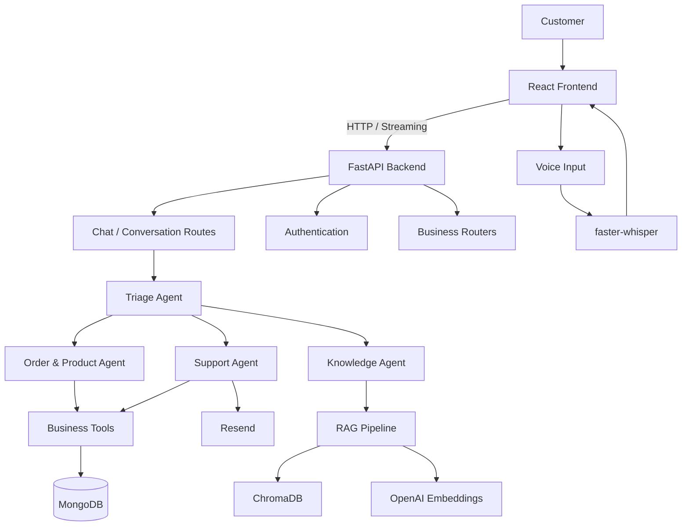

[README(2).md](https://github.com/user-attachments/files/30874173/README.2.md)
# TechStore AI Customer Support

An AI-powered customer support platform for a fictional electronics store, built with a **React frontend**, **FastAPI backend**, **MongoDB**, and an **agentic AI architecture**.

The system combines specialized AI agents, tool calling, RAG, MongoDB data, and voice input to provide an end-to-end customer support experience.

---

## Features

- 🤖 Multi-agent AI customer support
- 🔀 Triage and specialist agent handoffs
- ⚛️ React frontend
- 🚀 FastAPI backend
- 🍃 MongoDB database with Beanie/Motor
- 🛒 Product and order management
- 📦 Order status lookup
- ❌ Order cancellation with business-rule validation
- 💰 Refund eligibility checking
- 🎫 Support ticket lookup
- 📧 Human support escalation through Resend
- 📚 RAG-based FAQ and policy answers
- 🔎 ChromaDB vector search
- 🎙️ Voice input with faster-whisper
- 💬 Streaming chat responses
- 🔐 Customer authentication and owned-conversation access

---

## Architecture



### Request Flow

```text
React Frontend
      ↓
FastAPI API
      ↓
Triage Agent
      ↓
┌────────────────────┬─────────────────┬─────────────────┐
│                    │                 │
▼                    ▼                 ▼
Order & Product   Support Agent   Knowledge Agent
Agent
│                    │                 │
▼                    ▼                 ▼
Business Tools      Resend            RAG
│                                      │
▼                                      ▼
MongoDB                               ChromaDB
```

---

## Frontend

The frontend is built with **React** and is responsible for the customer-facing application.

It handles:

- Chat interface
- Conversation/session management
- Authentication UI
- Sending messages to the FastAPI backend
- Streaming assistant responses
- Voice input
- File/input interactions
- Displaying agent responses and conversation history

The frontend communicates with the backend through HTTP API endpoints rather than directly accessing MongoDB or the AI agents.

---

## Backend

The backend is built with **FastAPI** and provides the API layer between the React application and the AI/business logic.

Responsibilities include:

- Authentication
- Customer management
- Conversation management
- Chat streaming
- Database access
- Agent execution
- Business operations
- RAG retrieval
- Support escalation

FastAPI also provides automatic API documentation through:

```text
/docs
```

and:

```text
/redoc
```

---

## Agent System

### Triage Agent

The main coordinator.

It identifies the customer's intent and routes requests to the appropriate specialist.

It can handle multi-intent requests and continue the workflow until the requested tasks are completed.

### Order & Product Agent

Handles:

- Product search
- Order status
- Order cancellation
- Refund eligibility

It uses backend tools to retrieve and modify MongoDB data instead of guessing.

### Support Agent

Handles:

- Support ticket inquiries
- Human support escalation

Escalation uses the email service only when appropriate.

### Knowledge Agent

Handles:

- Return policy
- Warranty
- Shipping
- Store information
- FAQs

It uses the RAG pipeline to retrieve information from the TechStore knowledge base.

---

## Database

The project uses **MongoDB** for persistent application data.

The backend uses:

- **Beanie** for MongoDB ODM/model management
- **Motor** for asynchronous MongoDB access

The database stores application entities such as:

- Customers
- Products
- Orders
- Support tickets
- Conversations/messages
- Message logs

### Database Architecture

```text
FastAPI
   ↓
Beanie Models
   ↓
Motor
   ↓
MongoDB Atlas
```

This replaces the previous `fake_database.json` approach and allows data such as orders and conversations to persist between application restarts.

---

## API Structure

The backend is organized into routers, schemas, models, and database configuration.

A simplified structure is:

```text
api/
├── app.py
├── database.py
│
├── models/
│   ├── customer.py
│   ├── product.py
│   ├── order.py
│   ├── ticket.py
│   └── message_log.py
│
├── schemas/
│   └── Pydantic request/response schemas
│
└── routers/
    ├── auth.py
    ├── chat.py
    ├── conversations.py
    ├── customers.py
    ├── products.py
    ├── orders.py
    └── tickets.py
```

The exact router/model names can evolve as the backend grows, but the architecture keeps API routing, validation, database models, and AI logic separated.

---

## AI & RAG

The AI layer remains separated from the API layer.

```text
FastAPI
   ↓
Agent Team
   ↓
Specialized Agents
   ↓
Tools
   ├── MongoDB
   ├── Resend
   └── RAG
```

### RAG Pipeline

```text
knowledge_base/*.txt
        ↓
Document Loading
        ↓
Chunking
        ↓
OpenAI Embeddings
        ↓
ChromaDB
        ↓
Similarity Search
        ↓
Knowledge Agent
        ↓
Customer Response
```

Current knowledge-base content includes:

```text
knowledge_base/
├── faq.txt
├── return_policy.txt
├── shipping_policy.txt
├── store_information.txt
└── warranty.txt
```

A relevance threshold is used to avoid answering unrelated questions from irrelevant documents.

If the knowledge base is modified, rebuild the ChromaDB store so the new content is embedded.

---

## Tools

The AI agents can use business tools for real application operations:

| Tool | Purpose |
|---|---|
| `check_order_status` | Retrieve order information |
| `search_products` | Search products |
| `cancel_order` | Cancel eligible orders |
| `check_refund_eligibility` | Check refund eligibility |
| `ticket_inquiry` | Retrieve support ticket information |
| `send_support_email` | Escalate an issue to human support |
| `search_knowledge_base` | Retrieve policy and FAQ information |

The tools now interact with the application's backend/database instead of a local fake JSON database.

---

## Business Rules

Important rules are enforced by the backend/tool layer.

### Order Cancellation

```text
Processing → Can be cancelled
Shipped    → Cannot be cancelled
Delivered  → Cannot be cancelled
Cancelled  → Cannot be cancelled again
```

The AI cannot simply claim that an order was cancelled. The backend operation must succeed first.

### Knowledge Retrieval

Policy and FAQ questions are routed to the knowledge base.

Specific records such as an order ID or ticket ID are handled through the corresponding backend tools.

### Support Escalation

Human escalation is performed through the support email integration and should only be used when appropriate.

---

## Voice Input

The application supports voice messages using **faster-whisper**.

```text
Microphone
    ↓
React Frontend
    ↓
Voice/Audio Request
    ↓
faster-whisper
    ↓
Transcribed Text
    ↓
Chat API
    ↓
Agent Workflow
```

The transcription is performed locally rather than requiring a separate cloud transcription service.

---

## Project Structure

```text
techstore/
│
├── api/
│   ├── app.py
│   ├── database.py
│   ├── models/
│   ├── schemas/
│   └── routers/
│
├── frontend/
│   ├── src/
│   ├── public/
│   ├── package.json
│   └── ...
│
├── knowledge_base/
│   ├── faq.txt
│   ├── return_policy.txt
│   ├── shipping_policy.txt
│   ├── store_information.txt
│   └── warranty.txt
│
├── agent_team.py
├── tools.py
├── rag.py
├── schemas.py
│
├── test_files/
│
├── .env
├── .gitignore
├── pyproject.toml
├── uv.lock
└── README.md
```

---

## Technology Stack

### Frontend

- React
- JavaScript / JSX
- CSS
- Fetch/API communication

### Backend

- Python 3.12+
- FastAPI
- Uvicorn
- Pydantic

### Database

- MongoDB Atlas
- Beanie
- Motor

### AI

- OpenAI Agents SDK
- OpenAI models
- Function tools
- Agent handoffs
- OpenAI embeddings

### RAG

- ChromaDB
- `text-embedding-3-small`

### Voice

- faster-whisper

### External Services

- Resend

### Development

- `uv`
- Git / GitHub

---

## Setup

### 1. Clone the repository

```bash
git clone https://github.com/omarinho348/techstore.git
cd techstore
```

### 2. Install backend dependencies

Using `uv`:

```bash
uv sync
```

Or create a virtual environment manually:

```bash
python -m venv .venv
```

Activate it:

**Windows**

```powershell
.venv\Scripts\activate
```

**Linux / macOS / WSL**

```bash
source .venv/bin/activate
```

### 3. Install frontend dependencies

```bash
cd frontend
npm install
cd ..
```

---

## Environment Variables

Create a `.env` file for the backend:

```env
OPENAI_API_KEY=your_openai_api_key
MONGODB_URI=your_mongodb_connection_string
DATABASE_NAME=your_database_name

RESEND_API_KEY=your_resend_api_key
SUPPORT_TEAM_EMAIL=your_support_email
```

The exact environment variable names should match the project's configuration.

> Never commit `.env` or API keys to GitHub.

---

## Running the Application

### Start the FastAPI Backend

From the project root:

```bash
uv run uvicorn api.app:app --reload
```

The API will normally be available at:

```text
http://127.0.0.1:8000
```

Interactive API documentation:

```text
http://127.0.0.1:8000/docs
```

### Start the React Frontend

In another terminal:

```bash
cd frontend
npm run dev
```

The frontend will display its local development URL in the terminal.

Both applications must be running for the complete system to work.

---

## Example Requests

### Check Order Status

```text
Where is my order?
```

The request flows through:

```text
React
  ↓
FastAPI
  ↓
Triage Agent
  ↓
Order & Product Agent
  ↓
check_order_status()
  ↓
MongoDB
  ↓
Response
```

### Product Search

```text
Do you have any laptops available?
```

```text
React
  ↓
FastAPI
  ↓
Order & Product Agent
  ↓
search_products()
  ↓
MongoDB
```

### Knowledge Question

```text
What is your warranty policy?
```

```text
React
  ↓
FastAPI
  ↓
Knowledge Agent
  ↓
RAG
  ↓
ChromaDB
  ↓
Response
```

### Multi-Intent Request

```text
What is your return policy, and can I cancel my order?
```

The Triage Agent can route the different parts of the request to the appropriate tools/agents and combine the results.

---

## Authentication & Conversations

The FastAPI backend manages authenticated customers and their conversations.

A typical chat flow is:

```text
Login
  ↓
Authenticated Customer
  ↓
Create/Select Conversation
  ↓
POST /stream
  ↓
Verify Conversation Ownership
  ↓
Agent Workflow
  ↓
Stream Response
  ↓
Store Conversation Messages
```

Conversation ownership is checked by the backend so customers cannot access another customer's conversation.

---

## Testing

The repository contains tests for different parts of the system, including:

- Business rules
- Agent behavior
- RAG
- Conversations
- Email escalation
- API/backend functionality

Backend tests can be run from the project environment using the project's configured test scripts/framework.

---

## Key Design Principles

### 1. Specialized Agents

Different responsibilities are separated into focused agents.

### 2. Tool-Based Actions

The model uses tools for real business operations instead of inventing database results.

### 3. Business Logic Outside the LLM

Critical rules are enforced by backend code.

### 4. Persistent Database

MongoDB provides persistent storage for customers, products, orders, tickets, and conversations.

### 5. RAG Grounding

Company-specific information is retrieved from the TechStore knowledge base.

### 6. API Separation

The React frontend communicates with FastAPI through APIs instead of directly accessing the database or AI layer.

### 7. Streaming

The backend can stream AI responses to the React frontend for a more responsive chat experience.

---

## Future Improvements

- Improve authentication and authorization
- Add production-grade database indexing
- Add more advanced RAG retrieval/reranking
- Add agent tracing and observability
- Add automated agent evaluation
- Add stronger frontend error handling
- Add deployment configuration
- Add CI/CD
- Add production monitoring

---

## Project Status

Current architecture includes:

- [x] React frontend
- [x] FastAPI backend
- [x] MongoDB database
- [x] Beanie/Motor database integration
- [x] Customer authentication
- [x] Conversation management
- [x] Streaming chat endpoint
- [x] Multi-agent AI architecture
- [x] Agent handoffs
- [x] Business tools
- [x] RAG knowledge base
- [x] ChromaDB
- [x] Voice transcription
- [x] Resend support escalation
- [x] Backend/API separation

---

## License

No license file is currently included in the repository.

If this project is distributed publicly, add an appropriate `LICENSE` file.
