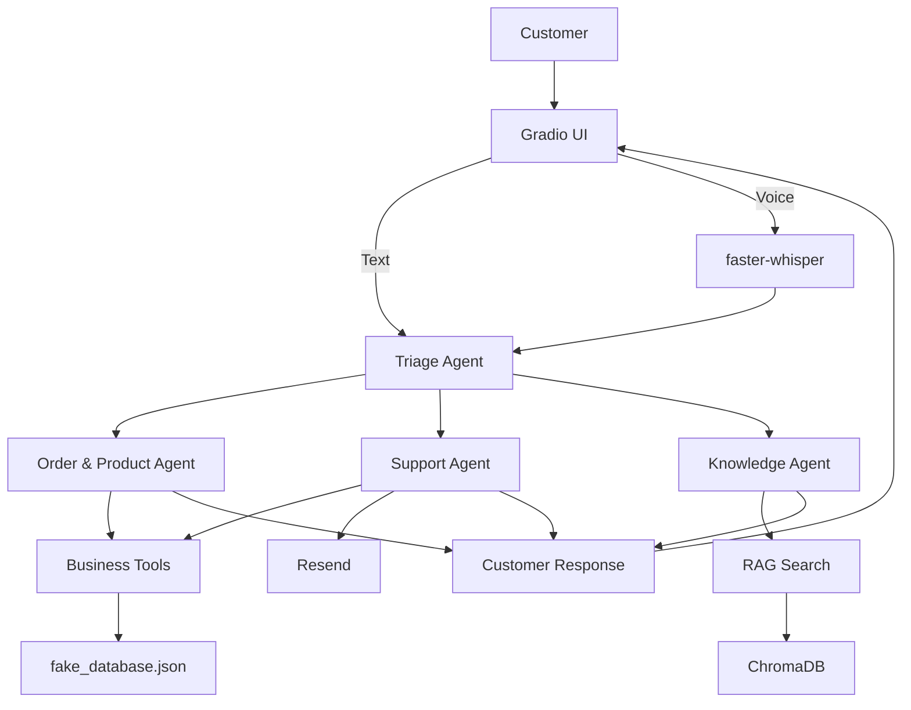

[README.md](https://github.com/user-attachments/files/30874137/README.md)
# TechStore AI Customer Support

An AI-powered customer support assistant for a fictional electronics store, built with a **multi-agent architecture**, **RAG**, **tool calling**, and **voice input**.

The system uses a Triage Agent to route customer requests to specialized agents for orders/products, support, and company knowledge.

---

## Features

- 🤖 Multi-agent customer support
- 🔀 Intelligent agent handoffs
- 🛒 Product and order management
- 📦 Order status lookup
- ❌ Order cancellation with business-rule validation
- 💰 Refund eligibility checking
- 🎫 Support ticket lookup
- 📧 Human support escalation through Resend
- 📚 RAG-based FAQ and policy answers
- 🔎 ChromaDB vector search
- 🎙️ Local voice transcription with faster-whisper
- 💬 Gradio chat interface
- ⚡ Streaming-style responses
- 🧪 Dedicated testing scripts

---

## Architecture



### Request Flow

```text
Customer
   ↓
Gradio UI
   ↓
Triage Agent
   ↓
┌────────────────────┬─────────────────┬─────────────────┐
│                    │                 │
▼                    ▼                 ▼
Order & Product   Support Agent   Knowledge Agent
Agent
│                    │                 │
▼                    ▼                 ▼
Business Tools     Resend            RAG
│                                      │
▼                                      ▼
Mock Database                         ChromaDB
```

---

## Agents

### Triage Agent

The main coordinator.

It identifies the customer's intent and routes the request to the appropriate specialist. It can handle requests containing multiple intents and ensures the required tasks are completed before producing the final response.

### Order & Product Agent

Handles:

- Order status
- Product search
- Order cancellation
- Refund eligibility

It relies on tools instead of guessing business information.

### Support Agent

Handles:

- Support ticket inquiries
- Human support escalation

When escalation is requested, it uses the email tool to contact the support team.

### Knowledge Agent

Handles:

- Return policy
- Warranty
- Shipping
- Store information
- FAQs

It uses the RAG knowledge base instead of relying only on the model's knowledge.

---

## Tools

The project contains seven main business tools:

| Tool | Purpose |
|---|---|
| `check_order_status` | Check order status, payment, and total |
| `search_products` | Search products by name/category |
| `cancel_order` | Cancel eligible orders |
| `check_refund_eligibility` | Check refund eligibility |
| `ticket_inquiry` | Look up support tickets |
| `send_support_email` | Escalate issues to human support |
| `search_knowledge_base` | Search company policies and FAQs |

Important business rules are enforced inside the tools.

For example:

```text
Processing → Can be cancelled
Shipped    → Cannot be cancelled
Delivered  → Cannot be cancelled
Cancelled  → Cannot be cancelled again
```

This prevents the model from bypassing the application's business logic.

---

## RAG Knowledge Base

The Knowledge Agent uses Retrieval-Augmented Generation with **ChromaDB** and **OpenAI embeddings**.

```text
knowledge_base/*.txt
        ↓
Document loading
        ↓
Paragraph chunks
        ↓
OpenAI embeddings
        ↓
ChromaDB
        ↓
User question
        ↓
Similarity search
        ↓
Relevant chunks
        ↓
Knowledge Agent
```

Current knowledge-base files:

```text
knowledge_base/
├── faq.txt
├── return_policy.txt
├── shipping_policy.txt
├── store_information.txt
└── warranty.txt
```

A relevance threshold is applied so unrelated questions do not automatically receive an irrelevant document.

To rebuild the vector store after changing the knowledge base, remove:

```text
chroma_store/
```

and restart the application.

---

## Voice Input

Voice messages are transcribed locally using **faster-whisper**.

```text
Microphone
    ↓
Gradio Audio
    ↓
faster-whisper
    ↓
Transcribed Text
    ↓
Normal Agent Workflow
```

The current configuration uses the Whisper `base` model with CPU/int8 processing.

---

## Project Structure

```text
techstore/
│
├── main.py
│   └── Application entry point and Gradio UI
│
├── agent_team.py
│   └── Triage and specialist agents
│
├── tools.py
│   └── Business tools and logic
│
├── rag.py
│   └── RAG ingestion and retrieval
│
├── schemas.py
│   └── Tool schemas
│
├── ui_config.py
│   └── UI styling/configuration
│
├── fake_database.json
│   └── Mock orders, products, and tickets
│
├── knowledge_base/
│   └── Store policies and FAQs
│
├── assets/
│   └── UI images/avatars
│
├── test_files/
│   └── Project tests
│
├── pyproject.toml
├── uv.lock
├── .gitignore
└── README.md
```

---

## Tech Stack

### AI & Agents

- Python 3.12+
- OpenAI Agents SDK
- OpenAI model: `gpt-5.4-mini`
- OpenAI embeddings: `text-embedding-3-small`
- Function tools
- Agent handoffs

### RAG

- ChromaDB
- OpenAI Embeddings
- Persistent local vector store

### UI

- Gradio
- Custom CSS
- Responsive chat interface

### Voice

- faster-whisper
- Local CPU transcription

### External Services

- Resend

### Development

- `uv`
- Python
- JSON
- Logging
- Test scripts

---

## Installation

### 1. Clone the repository

```bash
git clone https://github.com/omarinho348/techstore.git
cd techstore
```

### 2. Install dependencies

Using `uv`:

```bash
uv sync
```

Or with a standard virtual environment:

```bash
python -m venv .venv
```

Activate it:

**Windows**

```powershell
.venv\Scripts\activate
```

**Linux / macOS / WSL**

```bash
source .venv/bin/activate
```

Then:

```bash
pip install -e .
```

---

## Environment Variables

Create a `.env` file in the project root:

```env
OPENAI_API_KEY=your_openai_api_key
RESEND_API_KEY=your_resend_api_key
SUPPORT_TEAM_EMAIL=your_support_email
```

`OPENAI_API_KEY` is required.

The Resend variables are required for email escalation.

> Never commit your `.env` file or API keys to GitHub.

---

## Running the Application

With `uv`:

```bash
uv run python main.py
```

Or:

```bash
python main.py
```

Gradio will provide the local application URL, normally:

```text
http://127.0.0.1:7860
```

---

## Testing

The repository contains tests for the main components:

```text
test_files/
├── test_business_rules.py
├── test_conversation.py
├── test_email.py
├── test_knowledge_agent.py
├── test_rag.py
├── test_rag_integration.py
└── test_triage.py
```

Examples:

```bash
uv run python test_files/test_business_rules.py
```

```bash
uv run python test_files/test_rag.py
```

```bash
uv run python test_files/test_triage.py
```

Some tests require valid API credentials.

---

## Example Requests

### Order Status

```text
Where is order 1002?
```

```text
Triage Agent
    ↓
Order & Product Agent
    ↓
check_order_status()
    ↓
Response
```

### Product Search

```text
Do you have any phones?
```

The Order & Product Agent calls:

```text
search_products()
```

### Cancellation

```text
Please cancel order 1001.
```

The agent calls:

```text
cancel_order()
```

The tool determines whether the order is eligible for cancellation.

### Knowledge Question

```text
What is your warranty policy?
```

```text
Triage Agent
    ↓
Knowledge Agent
    ↓
search_knowledge_base()
    ↓
ChromaDB
    ↓
Relevant policy
```

### Human Escalation

```text
I need a human to help me. My email is customer@example.com.
```

The Support Agent uses:

```text
send_support_email()
```

to contact the support team through Resend.

---

## Multi-Intent Example

The system can handle multiple requests in one message:

```text
What is your warranty policy, and is order 1003 eligible
for a refund?
```

The Triage Agent can route the two tasks separately:

```text
Warranty question
      ↓
Knowledge Agent

Refund question
      ↓
Order & Product Agent
```

The final response combines the results for the customer.

---

## Data

The project currently uses:

```text
fake_database.json
```

as a mock database containing:

- Orders
- Products
- Support tickets

This is intended for development and demonstration.

Order changes are currently held in memory and are not persisted back to the JSON file.

---

## Adding Knowledge

To add another policy or FAQ:

1. Create a `.txt` file inside `knowledge_base/`
2. Add the relevant information
3. Delete `chroma_store/`
4. Restart the application

Example:

```text
knowledge_base/
├── faq.txt
├── return_policy.txt
├── shipping_policy.txt
├── store_information.txt
├── warranty.txt
└── payment_policy.txt
```

The RAG ingestion process automatically discovers `.txt` files in the directory.

---

## Key Design Principles

### Specialized Agents

Each agent has a focused responsibility instead of putting every task into one large prompt.

### Tool-Based Actions

Business operations are performed through Python tools rather than allowing the model to invent results.

### Business Rules Outside the LLM

Important constraints such as order cancellation eligibility are enforced by the application.

### RAG Grounding

Company-specific information comes from the TechStore knowledge base.

### Separation of Concerns

```text
UI
 ↓
Agents
 ↓
Tools
 ↓
Data / RAG / External Services
```

This makes the project easier to test, maintain, and extend.

---

## Future Improvements

Possible next steps include:

- Replace the JSON mock database with PostgreSQL
- Add authentication and authorization
- Persist order changes
- Add customer accounts
- Improve RAG chunking and retrieval
- Add hybrid search and reranking
- Add agent tracing and observability
- Add automated evaluation for agent responses
- Improve voice transcription performance
- Deploy the application to a production environment

---

## Project Status

The current implementation includes:

- [x] Multi-agent architecture
- [x] Triage and specialist agents
- [x] Agent handoffs
- [x] Business tools
- [x] Order/product operations
- [x] Support tickets
- [x] Email escalation
- [x] RAG knowledge base
- [x] ChromaDB
- [x] Voice transcription
- [x] Gradio interface
- [x] Testing scripts

---

## License

No license file is currently included in the repository.

If this project is distributed publicly, add an appropriate `LICENSE` file.
